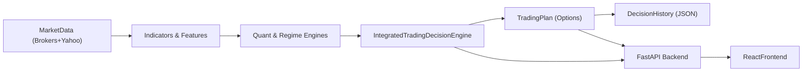

## AI Market Analyser – Architecture Overview

This document explains how the AI trading and market analysis system is structured end‑to‑end, from data ingestion to trade decisions and the web UI.

---

## 1. High‑Level System Layout

- **Backend (`backend/`)**: Python services and quant engines.
  - **FastAPI app** in `backend/main.py` exposes HTTP APIs for:
    - Integrated regime/quant analysis
    - Market history and backtests
    - Options, ICT, risk and learning endpoints
  - **Integrated Trading Engine** in `backend/trading_decision_engine.py`:
    - Orchestrates multiple models (momentum, regime, OU, volatility, MST).
    - Produces unified BUY/SELL/HOLD decisions and an options trading plan.
  - **Advanced Intraday System** in `backend/advanced_analysis.py`:
    - Intraday Nifty/Bank Nifty options engine.
    - Uses order flow, VWAP, ICT concepts and session timing.
- **Frontend (`src/`)**: React + TypeScript (Vite).
  - Pages such as `Dashboard.tsx`, `Backtest.tsx`, `History.tsx`, `Settings.tsx`.
  - Components like `TradeSetupCard.tsx`, `OptionsSignalCard.tsx`, `RiskAnalysisCard.tsx` consume backend APIs.
- **Entry scripts**:
  - `run_trading_system.py`: CLI entry for the integrated trading decision engine.
  - `run_web_app.py`: Starts the FastAPI backend and Vite frontend together.
  - `start_improved_system.py` / `start_fixed.py`: Convenience wrappers for production‑style startup.

---

## 2. Backend Components and Responsibilities

### 2.1 Data & Indicator Layer

- **Market data service** (`backend/services/market_data_service.py`):
  - `AsyncMarketDataService` orchestrates multiple providers with caching and validation:
    - **Broker providers** (`backend/services/broker_data_providers.py`) for Indian markets:
      - `AngelOneDataProvider` (SmartAPI).
      - `ZerodhaKiteProvider` (Kite Connect).
      - `GrowwDataProvider` (placeholder until public API exists).
    - Fallback providers:
      - `YahooFinanceProvider` (yfinance).
      - `AlphaVantageProvider` (if API key configured).
      - `SyntheticDataProvider` (for testing only).
  - Exposes `get_market_data` (async) and `get_sync_market_data` (sync wrapper) used by engines and utilities.
- **Market data utilities** (`backend/market_data.py`):
  - Fetch OHLCV data via the shared market data service when available (falls back to direct Yahoo calls).
  - Compute **SMA, EMA, RSI, MACD, Bollinger Bands, ATR, ADX** and related derived features.
- **Intraday utilities** (`backend/intraday_utils.py`):
  - Intraday VWAP and VWAP bands.
  - Strike‑selection helpers and market‑profile style metrics.

These modules present pre‑processed, provider‑agnostic dataframes to higher‑level trading engines.

### 2.2 Core Quant & Regime Modules

- **Momentum trading** (`backend/momentum_trading.py`):
  - Moving‑average crossover logic (e.g. 50/200).
  - Momentum scoring based on trend, Sharpe‑like measures and return‑of‑change.
- **Regime detection** (`backend/regime_detection.py`):
  - Macro/volatility **regime classification** (RISK_ON, RISK_OFF, EXPANSIONARY, RECESSIONARY, NEUTRAL).
  - Markov regime‑switching model for volatility clustering.
- **Mean reversion (OU)** (`backend/ornstein_uhlenbeck.py`):
  - Ornstein–Uhlenbeck model calibration on price/returns.
  - Z‑score based LONG/SHORT mean‑reversion signals.
- **Market structure & MST** (`backend/mst_analysis.py`):
  - Correlation matrix for Nifty 50 stocks.
  - Minimum Spanning Tree for structural relationships and relative trades.
- **Quant engine** (`backend/quant_engine.py`):
  - Wasserstein distance between return distributions to detect drift.
  - Entropy, volatility and Monte‑Carlo based risk metrics.
- **Bayesian engine** (`backend/bayesian_inference.py`):
  - Bayesian updating of win‑rate using Beta posteriors.
  - Kelly‑style fractional allocation for strategies.

These are **signal and risk providers** feeding into the higher‑level decision engines.

### 2.3 Options & Smart‑Money Modules

- **Options indicators** (`backend/options_indicators.py`):
  - Black–Scholes based option Greeks (Delta, Gamma, Theta, Vega).
  - Option‑chain analytics for Nifty/Bank Nifty index options.
- **Order flow & market profile** (`backend/order_flow.py`):
  - Value Area High/Low, VPOC and key volume levels.
  - Intraday support/resistance, breakout and rejection detection.
- **Institutional / Level‑2 order flow** (`backend/institutional_order_flow.py`):
  - `InstitutionalOrderFlowAnalyzer` works on broker order books (Level 2) to compute:
    - Bid/ask imbalance and order‑flow delta.
    - Large order footprints (institutional vs retail).
    - Absorption at key levels and momentum shifts in order flow.
  - Consumed by `OrderFlowAnalyzer.get_enhanced_entry_recommendation` and the advanced intraday system when broker data is available.
- **ICT / Smart Money Concepts** (`backend/ict_smart_money.py`):
  - Fair Value Gaps (FVGs).
  - Bullish/Bearish Order Blocks as zones for entries and stops.
- **Market timing** (`backend/market_timing.py`, `backend/nifty_timing.py`):
  - Session segmentation for Indian markets (open, lunch, close).
  - Opening Range Breakout (ORB) style timing logic.

These modules specialize in **intraday options and smart‑money style** execution logic.

### 2.4 Risk Management & Position Sizing

- **Volatility‑based sizing** (`backend/volatility_position_sizing.py`):
  - `VolatilityPositionSizer`: position sizing from a **target portfolio volatility** and a **max per‑position volatility**.
  - `RealTimeVolatilityMonitor`: rolling realized volatility for instruments.
- **Exit system** (`backend/exit_system.py`):
  - ATR‑based stops and profit targets.
  - Trailing stops, partial profit‑taking and time/IV‑based exits.

These modules ensure **risk is scaled to volatility** and that exits respect both price and time decay.

### 2.5 Web API Layer

- **FastAPI application** (`backend/main.py`):
  - Wires together:
    - Integrated quant/regime engine.
    - Advanced intraday engine.
    - Options/Risk/ICT utilities.
  - Exposes REST endpoints consumed by the React frontend (e.g. latest regime, quant metrics, options signals, backtests).

---

## 3. Frontend Overview

The frontend (in `src/`) is a Vite + React + TypeScript single‑page application.

- **Pages**:
  - `Dashboard.tsx`: high‑level market and trading overview.
  - `Backtest.tsx`: visualization of backtest results and parameter sweeps.
  - `History.tsx`: shows recent trades/decisions from backend outputs.
  - `Settings.tsx`: configuration and environment information.
- **Key components**:
  - `TradeSetupCard.tsx`: renders the current integrated trading decision and plan.
  - `OptionsSignalCard.tsx`: summarizes options‑specific signals and Greeks.
  - `BayesianStrategyCard.tsx`, `RiskAnalysisCard.tsx`: visualize Bayesian and risk metrics.
  - Broker‑related components under `components/broker/` display portfolio, orders and broker connectivity.

All of these call backend endpoints defined in `backend/main.py` via typed hooks in `src/hooks/`.

---

## 4. Integrated Trading Decision Engine Flow

The integrated engine implemented in `backend/trading_decision_engine.py` combines multiple models to produce a single trading action.

### 4.1 Data Flow

1. **Input**:
   - Ticker: by default `^NSEI` (Nifty index).
   - Capital: e.g. ₹1,000,000.
2. **Market data fetch** (`_get_market_data`):
   - First tries the shared **market data service** (`get_sync_market_data`) which:
     - Prefers broker providers (Angel One / Zerodha) when configured.
     - Falls back to Yahoo/Alpha Vantage/Synthetic providers.
   - Normalizes columns and ensures there is a `Close` column regardless of source.

### 4.2 Module Execution

Within `run_comprehensive_analysis`:

1. **Momentum analysis**:
   - `MomentumTradingSystem.generate_trading_plan(df)` returns an action (BUY/SELL/HOLD) and confidence plus ATR and other internals.
2. **Volatility analysis**:
   - `RealTimeVolatilityMonitor.update_volatility()` returns realized volatility per ticker.
3. **Market regime**:
   - `MarketRegimeDetector.determine_regime()` computes a primary regime label and confidence.
4. **Mean‑reversion (OU)**:
   - `RealTimeOUTrading.update_and_get_signals(\"1d\")` produces LONG/SHORT mean‑reversion signals with confidence.
5. **Markov switching** (diagnostic):
   - `MarkovRegimeSwitching.fit()` returns fitted regime parameters on daily returns.

### 4.3 Signal Aggregation

The `_aggregate_signals` method:

- Maintains a `scores = {'BUY': 0.0, 'SELL': 0.0, 'HOLD': 0.0}` dictionary.
- Uses **weights**:
  - Momentum: **0.4**
  - Regime: **0.3**
  - OU: **0.3**
- **Momentum**:
  - Adds `momentum_confidence × 0.4` to the momentum action.
- **Regime**:
  - If primary regime in `['RISK_ON', 'EXPANSIONARY']` → adds to BUY.
  - If primary regime in `['RISK_OFF', 'RECESSIONARY']` → adds to SELL.
  - Else → adds to HOLD.
- **OU**:
  - For each OU signal:
    - LONG → adds `confidence × 0.3` to BUY.
    - SHORT → adds `confidence × 0.3` to SELL.
  - If no OU signals, adds a small HOLD score.
- Final **action** is `argmax` over scores, with `final_conf` as the chosen score.

### 4.4 Trading Plan Construction

`_create_trading_plan`:

- If action is `HOLD`, returns a trivial plan.
- Otherwise:
  - Uses **current price** from the last `Close`.
  - Uses realized volatility from `RealTimeVolatilityMonitor`.
  - Calls `VolatilityPositionSizer.calculate_position_size(vol)` to determine position value and size.
  - Uses ATR from `MomentumTradingSystem.calculate_atr(df)` to define:
    - BUY:
      - Stop loss at `price − 2 × ATR`.
      - Target at `price + 3 × ATR`.
      - Strategy: **Bull Call Spread**.
    - SELL:
      - Stop loss at `price + 2 × ATR`.
      - Target at `price − 3 × ATR`.
      - Strategy: **Bear Put Spread**.
- Saves each decision and plan to a JSON file under `trading_decisions/`.

---

## 5. Advanced Intraday Options System Flow

The advanced system in `backend/advanced_analysis.py` focuses on intraday index options (Nifty, Bank Nifty, Sensex).

High‑level responsibilities:

1. **Data & context**:
   - Fetches intraday OHLCV and option‑chain data.
   - Uses `intraday_utils`, `order_flow`, `options_indicators` and `ict_smart_money` to build an enriched intraday view.
2. **Signal components**:
   - **Order flow confluence** around VPOC and key levels.
   - **ICT structures** (FVGs, Order Blocks) near price.
   - **Timing/ORB** logic from `nifty_timing` (e.g. focusing on opening range breaks).
3. **Entry decision**:
   - Combines:
     - Order‑flow confidence (e.g. 45% weight).
     - ORB signal (e.g. 25% weight).
     - Timing/session context (e.g. 20% weight).
   - Requires minimum confluence/score (e.g. ≥ 0.4) and ICT alignment for high‑probability entries.
4. **Options selection and exits**:
   - Chooses suitable call/put strikes and spread structures based on volatility and distance to key levels.
   - Uses exit logic from `exit_system.py` for intraday stops, targets, and time‑based exits (theta and expiry awareness).

This system is designed for **day trading index options** with a strong focus on microstructure, smart‑money concepts and precise timing.

---

## 6. End‑to‑End Data & Decision Flow Diagram

This flow applies both to the CLI entry (`run_trading_system.py`) and to the web application (`run_web_app.py`), where the same core decision logic is exposed through HTTP APIs and visualized by the React UI.

